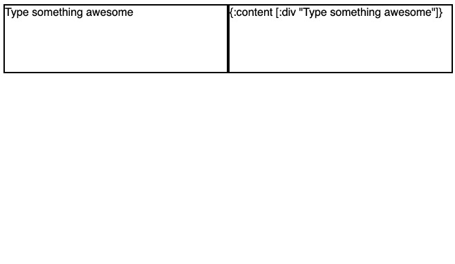

<p align="center">
  <a href="#"></a>
</p>

<p align="center">
  A <em>completely</em> customizable framework <br/>
  for building rich text editors in ClojureScript.
</p>
<br/>

<p align="center">
  <a href="#design"><strong>Design goals</strong></a> ·
  <a href="https://beautiful-haupia-5c51c7.netlify.app/"><strong>Demo</strong></a>
</p>
<br/>

<p align="center">
  <a href="#"></a> ·
</p>
<br/>
</p>

## Design goals

- Nested document model. The document model used for Rich is a nested, recursive tree, just like the DOM itself. The document tree adheres to the [hickory](https://github.com/davidsantiago/hickory) format to make converting to and from HTML easy. Because it's a tree and not a flat list of characters, creating complex components like tables or nested block quotes are possible for advanced use cases.

- Flexible schemas. The nodes in Rich's document model are open maps, and the core assumes very little about the schema of the data you'll be editing. That means that there are no assumptions baked into the library that'll trip you up when you need to go beyond the most basic use cases.

- Parallel to the DOM. Rich's data model is based on the DOM—the document is a nested tree, it uses selections and ranges, and it exposes all the standard event handlers. This means that advanced behaviors like tables or nested block quotes are possible. Pretty much anything you can do in the DOM, you can do in Rich.

- Intuitive commands. Rich documents are edited using "commands", that are designed to be high-level and extremely intuitive to write and read, so that custom functionality is as expressive as possible. This greatly increases your ability to reason about your code.

- Collaboration-ready data model. The data model Rich uses—specifically how operations are applied to the document—has been designed to allow for collaborative editing to be layered on top, so you won't need to rethink everything if you decide to make your editor collaborative.

- Clear "core" boundaries. With a plugin-first architecture, and a schema-less core, it becomes a lot clearer where the boundary is between "core" and "custom", which means that the core experience doesn't get bogged down in edge cases.

## Demo

To get an idea of how you might use Rich, check out the [demo](https://beautiful-haupia-5c51c7.netlify.app/).

To run the demo site yourself, clone this repo and run:

```
npm install
npm run build
```

## Examples

To get started using Rich, it might help to start with an example.

- [Plain text](https://github.com/calherries/rich/blob/master/examples/editors/plain_text.cljs) -- showing the most basic case: a glorified `<textarea>`
- [Rich text](https://github.com/calherries/rich/blob/master/examples/editors/rich_text.cljs) -- showing the features you'd most likely expect from an editor.
- More to come...

## Features

- Deserialize text editor state to JSON, EDN, and its contents to HTML
- Undoable state
- Extensible command pallette

## Roadmap

- Paste with or without formatting
- Full rich text demo with reagent, including toolbars and multiple editors
- Remove dependency on reagent
- Remove dependency on React
- Compatibility with CRDTs for collaborative editing
- Markdown editor demo
- Customizable toolbars
